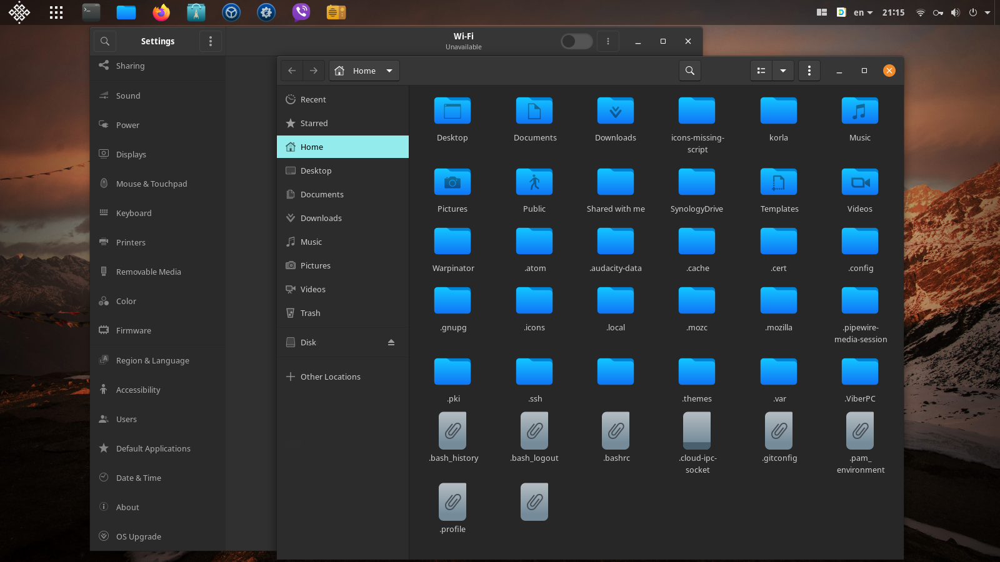
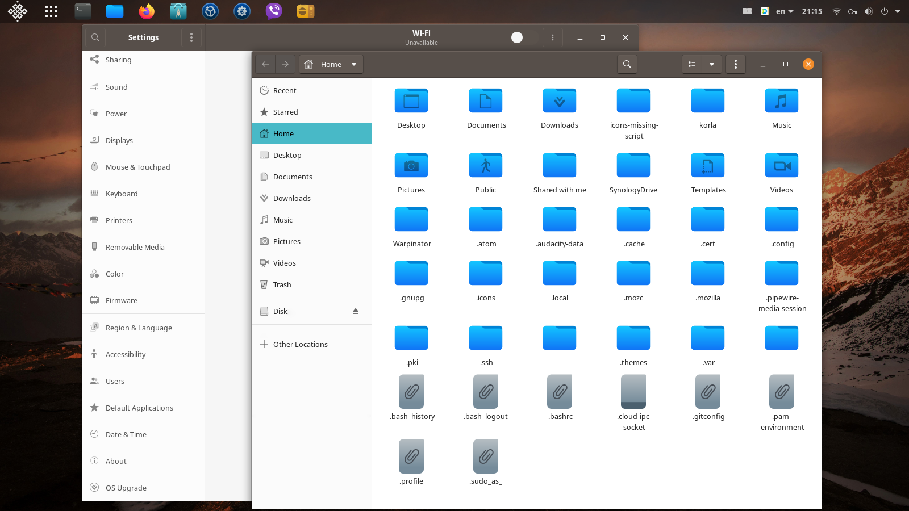
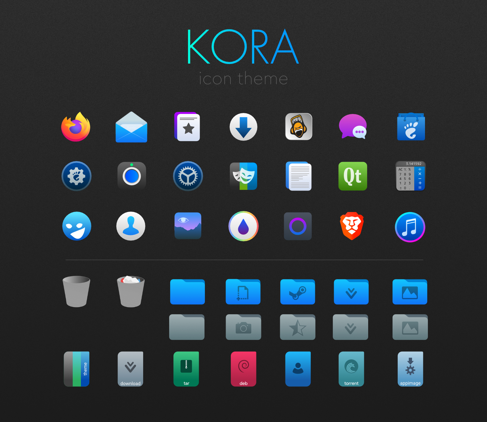

# KORA

⚠️ **This is personal fork of bikass/kora with some icons replaced**

**Kora** is an SVG icon theme with lots of new icons for GNU/Linux operating systems.

To make them display properly, you may need to update the icon cache. A script is included.

Different versions available:

- **_kora_** - for dark themes with dark panel
- **_kora-light_** - for light themes with dark panel (depends on Kora)
- **_kora-light-panel_** - for light themes with light panel (depends on Kora and Kora-light)
- **_kora-pgrey_** - theme with grey folder colors (depends on Kora)

## Installation

Clone this repository on your system

    git clone https://github.com/bikass/kora.git

and copy **_kora_**, **_kora-light_**, **_kora-light-panel_** and **_kora-pgrey_** subfolders to one of the following folders:

- `/usr/share/icons/` - icons available system-wide
- `$HOME/.local/share/icons/` - icons only available to local user

### Specific Linux distributions

- **Arch**: [stable](https://aur.archlinux.org/packages/kora-icon-theme/)
- **openSuse**: [repository](https://build.opensuse.org/package/show/home:guinuxbr/kora-icon-theme)
- **Solus**: sudo eopkg it korla-icon-theme

## Preview

## License

[GPL3](https://www.gnu.org/licenses/gpl-3.0-standalone.html)
